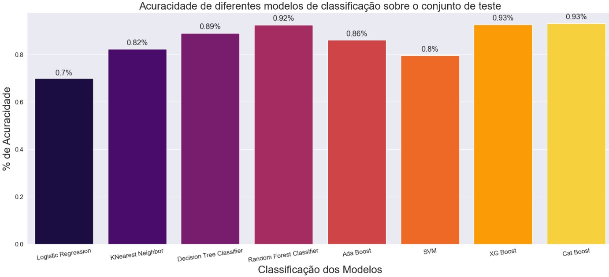

# Finalidade: Estudo / Exploração
# EDA/ML com Python
Tema - Predição de Acidente Vascular Cerebral(AVC), com base em fatores de risco. 

## Estrutura do Projeto
```
├───── Diretório
│   ├── data
│   ├── Documentos
│   ├── img
│   ├── Template(PUC)
├── stroke_prediction.ipynb
```

## Requisitos
- [Python](https://www.python.org/)
- [Jupyter](https://jupyter.org/), [VS Code](https://code.visualstudio.com/docs/) ou uma ferramenta equivalente para execução do arquivo "stroke_prediction.ipynb"

## Iniciando
Baixar ou Clonar (via Git) a pasta do projeto deste link [Stroke_Prediction](https://github.com/LucianobSilva/stroke_prediction).


## Executando Projeto 
Após baixar ou clonar repositório basta executar o arquivo stroke_prediction.ipynb

## Instale as dependências do projeto utilizando o comando:
```
pip install -r requirements.txt
```

## 1. Introdução 
O AVC é uma das principais causas de morte e incapacidade no mundo. Modificações no estilo de vida e medicação adequada podem prevenir ao menos 50% dos eventos de AVC. Este estudo tem como finalidade desenvolver um modelo de aprendizado de máquina para prever o risco de AVC com base em fatores de risco. Serão abordadas técnicas de preparação de dados e análises exploratórias.


## 2. Descrição do Problema 
O objetivo é realizar o tratamento e a coleta de dados clínicos relevantes para a identificação do risco de AVC, e em seguida utilizar análises exploratórias e modelagem preditiva para prever esse risco. O objetivo é avaliar alguns modelos e sua eficácia na identificação precoce de pacientes com risco de AVC. 

Para garantir modelos preditivos eficazes, os dados clínicos serão tratados com cuidado. Isso envolve correção de erros, detecção de dados faltantes ou outliers e normalização de valores, se necessário. Somente após esse tratamento cuidadoso dos dados é possível construir modelos confiáveis para a identificação do risco de AVC.


## 3. Coleta dos Dados
### Base de dados: Stroke Prediction Dataset
Fonte: https://www.kaggle.com/datasets/fedesoriano/stroke-prediction-dataset


## Referências 

WHO. AVC, Acidente Vascular Encefálico Disponível em:
https://www.emro.who.int/health-topics/stroke-cerebrovascular-accident/index.html. Acesso em: 03/02/2023.

TabNet DataSUS. Sistema de Vigilância Alimentar e Nutricional - SISVAN. Disponível em: http://tabnet.datasus.gov.br/cgi/SISVAN/CNV/notas_sisvan.html. Acesso em: 15/07/2023.

Associação Brasileira para o Estudo da Obesidade e da Síndrome Metabólica (ABESO). Qual o valor normal da glicemia? Saiba o que é e como medir corretamente. Disponível em: https://abeso.org.br/qual-o-valor-normal-da-glicemia-saiba-o-que-e-e-como-medir-corretamente/ . Acesso em: 18/07/2023.

PIEPER, Brett Slatkin. Python Eficaz: 59 maneiras de escrever melhores códigos em Python. São Paulo: Novatec, 2016.

MORETTIN, Pedro A.; SINGER, Julio M. Estatística e Ciência de Dados. 1ª ed. Rio de Janeiro: LTC, 2022.

GERON, Aurélien. Mãos à Obra Aprendizado de Máquina com Scikit-Learn, Keras e TensorFlow: Conceitos, ferramentas e técnicas para a construção de sistemas inteligentes. 2ª ed. São Paulo: Novatec, 2020.


## Avaliação de Resultados




O objetivo deste estudo foi desenvolver um modelo de classificação capaz de prever a ocorrência de acidente vascular cerebral (AVC) com base em fatores de risco identificados em um conjunto de dados do Kaggle. 

Na etapa de preparação dos dados, foi realizado análise exploratória detalhada para entender a estrutura do conjunto de dados e identificar possíveis problemas, como valores faltantes e desequilíbrio das classes. Para lidar com o desequilíbrio, foi aplicado técnica de OverSampling para aumentar o número de instâncias da classe minoritária e garantir uma representação mais equilibrada das classes de AVC e não AVC.

Em seguida, foi utilizado diferentes algoritmos de classificação, incluindo Regressão Logística, KNearest Neighbor, Decision Tree Classifier, Random Forest Classifier, Ada Boost, SVM, XG Boost e Cat Boost, para criar os modelos preditivos. Cada modelo foi treinado e avaliado usando métricas como acurácia, precisão, recall e a curva ROC-AUC para medir seu desempenho e capacidade de generalização.

Os resultados obtidos foram promissores, com diversos modelos alcançando altas taxas de acurácia e AUC, indicando uma boa capacidade de classificação. Dentre eles, o modelo Cat Boost se destacou com a maior acurácia de validação (93.64%), seguido pelo XG Boost (93.05%) e Random Forest Classifier (92.27%).


## Contribuição
Contribuições são bem-vindas! Sinta-se à vontade para abrir issues para relatar bugs, sugerir melhorias ou enviar pull requests para resolver problemas existentes.